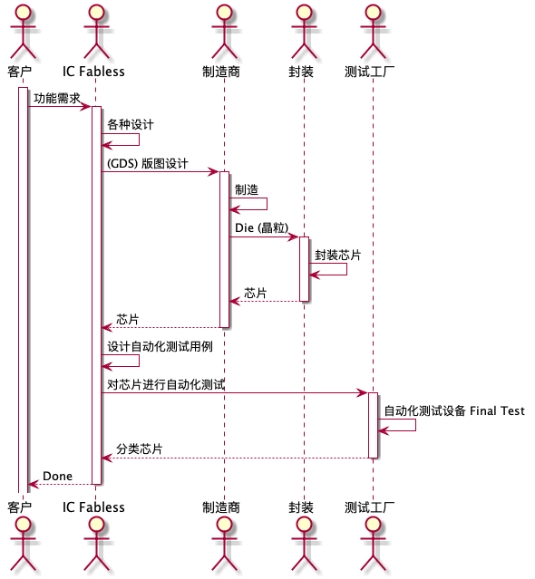
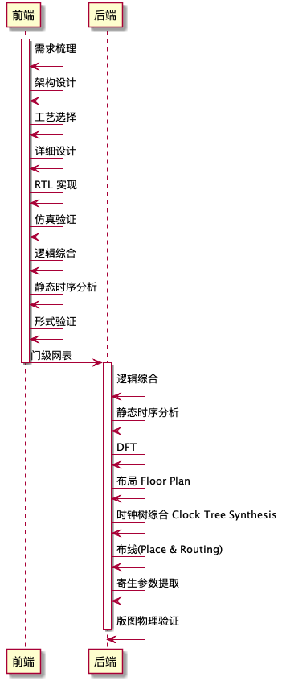
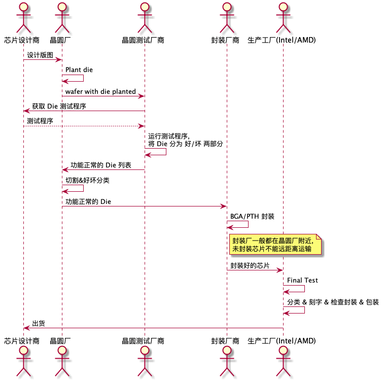

---

layout: post  
title: "芯片设计过程以及技术（持续更新）"  
date: 2019-12-28 12:40:20 +0800  
categories: IC  
tags: IC  
excerpt: 芯片设计是一个非常复杂的工程，我们的日常生活已经充满了一块一块小小的芯片，从门禁、手机、MP3、电视。一个小小的芯片上面可能就有千万或者更多个单元，它们一个个排列，相连组成一个个整体实现一个个功能。那么它们是怎样设计出来的呢？  
description: 芯片设计是一个非常复杂的工程，我们的日常生活已经充满了一块一块小小的芯片，从门禁、手机、MP3、电视。一个小小的芯片上面可能就有千万或者更多个单元，它们一个个排列，相连组成一个个整体实现一个个功能。那么它们是怎样设计出来的呢？  

---

芯片设计是一个非常复杂的工程，我们的日常生活已经充满了一块一块小小的芯片，从门禁、手机、MP3、电视。  
一个小小的芯片上面可能就有千万或者更多个单元，它们一个个排列，相连组成一个个整体实现一个个功能。那么它们是怎样设计出来的呢？  

# 名词缩写

<table border="2" cellspacing="0" cellpadding="6" rules="groups" frame="hsides">

<colgroup>
<col  class="org-left" />

<col  class="org-left" />

<col  class="org-left" />
</colgroup>
<thead>
<tr>
<th scope="col" class="org-left">缩写</th>
<th scope="col" class="org-left">全称</th>
<th scope="col" class="org-left">解释</th>
</tr>
</thead>

<tbody>
<tr>
<td class="org-left">GDS</td>
<td class="org-left">Geometry Data Standard</td>
<td class="org-left">描述集成电路伴读的一种格式，包括晶体管大小，数量，位置，连线，尺寸位置信息，是二进制文件</td>
</tr>

<tr>
<td class="org-left">NOC</td>
<td class="org-left">Network On Chip</td>
<td class="org-left">片上互联网络</td>
</tr>

<tr>
<td class="org-left">PHY</td>
<td class="org-left">PHYcial layer</td>
<td class="org-left">物理连接</td>
</tr>

<tr>
<td class="org-left">HDP</td>
<td class="org-left">High density plasma</td>
<td class="org-left">高密度等离子体（能够定制沉积和原位刻蚀形貌 ，具有最佳的硅片间厚度均匀性和间隙填充均匀性）</td>
</tr>

<tr>
<td class="org-left">CIP</td>
<td class="org-left">Core Independent Peripherals</td>
<td class="org-left">Autonomous Peripherals operation, 独立于 CPU 的外设，用来减轻延迟，增加吞吐量</td>
</tr>

<tr>
<td class="org-left">UMC</td>
<td class="org-left">United Microelectronics Corporation</td>
<td class="org-left">华联电子</td>
</tr>

<tr>
<td class="org-left">HBMH</td>
<td class="org-left">High Bandwidth Memory</td>
<td class="org-left">高带宽内存芯片</td>
</tr>

<tr>
<td class="org-left">CP</td>
<td class="org-left">Chip Probe</td>
<td class="org-left">晶圆CP 测试， 常用于功能测试和性能测试中，了解芯片是否工作正常，以及筛掉晶粒中的故障晶粒。</td>
</tr>

<tr>
<td class="org-left">ATE</td>
<td class="org-left">Auto Test Equipment</td>
<td class="org-left">自动化测试设备</td>
</tr>

<tr>
<td class="org-left">DC</td>
<td class="org-left">Design Compiler</td>
<td class="org-left">将RTL 编译为门级电路</td>
</tr>

<tr>
<td class="org-left">STA</td>
<td class="org-left">Static Timing Analysis</td>
<td class="org-left">静态时序分析</td>
</tr>

<tr>
<td class="org-left">CHI</td>
<td class="org-left">Coherent Hub Interface</td>
<td class="org-left">高性能互联中心，用来连接高性能处理器和内存控制器</td>
</tr>

<tr>
<td class="org-left">BGA</td>
<td class="org-left">Ball Grid Array</td>
<td class="org-left">球栅阵列</td>
</tr>

<tr>
<td class="org-left">PTH</td>
<td class="org-left">Pin Through Hole</td>
<td class="org-left">针脚封装</td>
</tr>

<tr>
<td class="org-left">&#xa0;</td>
<td class="org-left">&#xa0;</td>
<td class="org-left">&#xa0;</td>
</tr>
</tbody>
</table>

# 芯片设计过程

芯片总体的设计过程如下所示：  

  

芯片设计的整体流程按照朝向设计可以分为正向设计和反向设计。  
正向设计一般用于新功能的开发，反向设计一般用于芯片的反向分析。  
作为无晶圆公司，一般只会负责芯片的设计工作，一般设计详细的过程如下所示：  

  

生产制造的详细过程如下所示：  

  

# 技术详解

## CP(Chip Probe)

芯片的生产过程是通过一大片晶圆统一进行制造。这个大晶圆称之为 Wafer. 大晶圆上小的独立的小芯片块，我们称之为晶粒（Die）。  
晶圆CP 测试， 常用于功能测试和性能测试中，了解芯片是否工作正常，以及筛掉晶粒中的故障晶粒。  
CP 使用一个探针（Probe） 来扎 Wafer 上的 Die ,把各类信号输入 Die, 然后抓取输出信号，进行比较和运算，以验证芯片是否有问题。  
有的芯片还需要进行一步 Trim , 即配置调整芯片。在这个阶段主要会使用的设备是： 自动化测试设备（ATE, auto test equipment），探针台（Prober），仪器仪表。但是针对每个芯片的设计不同，  
制造厂商需要对每个芯片制芯造片探针卡（Probe Card），用来进行 probe.  

## NOC(Network on chip)

一种多核场景下的互联技术。引用计算机网络中的概念，使用互联网络的技术来解决传统在多核场景下出现的各种问题。  
传统的 SOC 都使用总线互联结构，但是当一个芯片中集成的芯片越来越多的时候，总线结构会出现一些问题，比如  

<table border="2" cellspacing="0" cellpadding="6" rules="groups" frame="hsides">

<colgroup>
<col  class="org-left" />

<col  class="org-left" />

<col  class="org-left" />
</colgroup>
<thead>
<tr>
<th scope="col" class="org-left">特性</th>
<th scope="col" class="org-left">BUS</th>
<th scope="col" class="org-left">NoC</th>
</tr>
</thead>

<tbody>
<tr>
<td class="org-left">通讯性能</td>
<td class="org-left">因为同一时刻，只能有一组设备进行通信。</td>
<td class="org-left">片上的网络话通信平台，具有比较丰富地信道资源，多个 IP 之间可以使用</td>
</tr>

<tr>
<td class="org-left">&#xa0;</td>
<td class="org-left">当总线上设备比较多的时候，总线的通信效率是系统性能提升瓶颈。</td>
<td class="org-left">不同地物理线路并行传输。并且随着 IP 的增加，信道资源会更加丰富。</td>
</tr>

<tr>
<td class="org-left">&#xa0;</td>
<td class="org-left">&#xa0;</td>
<td class="org-left">具有较高的传输带宽，和较高的传输效率（不同竞争总线）</td>
</tr>
</tbody>

<tbody>
<tr>
<td class="org-left">可扩展性</td>
<td class="org-left">总线结构需要针对不同的系统进行设计（因为有时钟，IP 数）等很多影响因素</td>
<td class="org-left">因为有全局互联网络的存在，新添加设备只需要将设备通过网络接口（NI）</td>
</tr>

<tr>
<td class="org-left">&#xa0;</td>
<td class="org-left">可扩展性比较差</td>
<td class="org-left">介入到网络中的路由节点即可</td>
</tr>
</tbody>

<tbody>
<tr>
<td class="org-left">功耗</td>
<td class="org-left">随着 SOC 集成的 IP 数量增加，总线的使用率会增加。</td>
<td class="org-left">因为是分布式网络，信息交互产生的功耗与信息传输的节点有关系，</td>
</tr>

<tr>
<td class="org-left">&#xa0;</td>
<td class="org-left">每次使用总线都需要驱动全局互联线，总线的结构的功耗，很难降低。</td>
<td class="org-left">距离相近的节点数据传输功耗非常低</td>
</tr>

<tr>
<td class="org-left">&#xa0;</td>
<td class="org-left">并且随着工艺的提升，想要保证全局的同步时钟也将变得难以实现。</td>
<td class="org-left">&#xa0;</td>
</tr>
</tbody>

<tbody>
<tr>
<td class="org-left">信号的完整性</td>
<td class="org-left">随着集成电路特征尺寸的不断减小，电路规模的不断增大，互连线的宽度</td>
<td class="org-left">&#xa0;</td>
</tr>

<tr>
<td class="org-left">和信号延迟</td>
<td class="org-left">和间距也在不断的减小，线间耦合电容相应增大，长的全局并行总线会引起</td>
<td class="org-left">&#xa0;</td>
</tr>

<tr>
<td class="org-left">&#xa0;</td>
<td class="org-left">较大的串绕噪声，从而影响信号的完整性和信号传输的正确性。</td>
<td class="org-left">&#xa0;</td>
</tr>

<tr>
<td class="org-left">&#xa0;</td>
<td class="org-left">同时互连线上的延迟将成为影响信号延迟的主要原因，总线结构的全局互联</td>
<td class="org-left">&#xa0;</td>
</tr>

<tr>
<td class="org-left">&#xa0;</td>
<td class="org-left">线上的延迟将大于一个时钟周期，从而使得时钟周期的偏移难以管理</td>
<td class="org-left">&#xa0;</td>
</tr>
</tbody>

<tbody>
<tr>
<td class="org-left">全局同步</td>
<td class="org-left">总线结构采用全局同步时钟，随着芯片集成度提高，芯片的工作频率也在不断</td>
<td class="org-left">&#xa0;</td>
</tr>

<tr>
<td class="org-left">&#xa0;</td>
<td class="org-left">的提高，会在芯片内部形成一个比较大的时钟树，很难实现片上各个模块的时钟</td>
<td class="org-left">&#xa0;</td>
</tr>

<tr>
<td class="org-left">&#xa0;</td>
<td class="org-left">同步。虽然可以使用时钟树优化方法，但是时钟树的动态功耗占比甚至达到 40%</td>
<td class="org-left">&#xa0;</td>
</tr>
</tbody>
</table>

详情可以参考  

1.  [片上网络（NoC）技术的背景、意义以及发展\_Pieces\_thinking的博客-CSDN博客](https://blog.csdn.net/Pieces_thinking/article/details/77938041)
2.  [A comparison of Network-on-Chip and Busses](https://www.design-reuse.com/articles/10496/a-comparison-of-network-on-chip-and-busses.html)

## Crossbar

一种交叉相连的连接模式。可以同时连接多个主存部件，可以有效的提高系统的吞吐量。  

## HBM

一种新型的 CPU/GPU 内存芯片，通过将很多个 DDR 芯片堆叠在一起, 实现大容量，高位宽的DDR阵列。最新的HPM 带宽可以达到 1Tb/s. 详情参考  
[HBM火了，它到底是什么？ - 知乎](https://zhuanlan.zhihu.com/p/33990592)  

